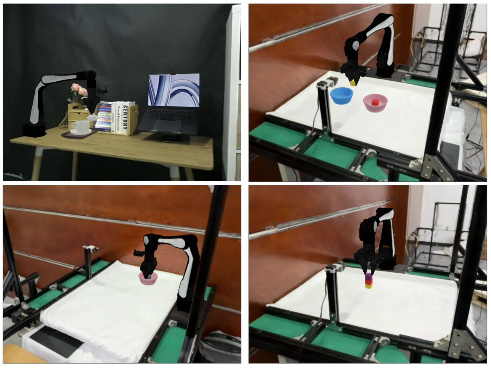
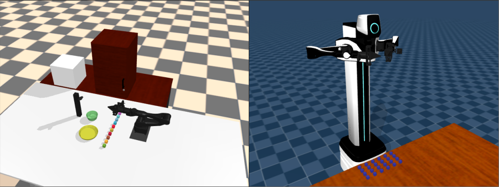

<h1 align="center">
	DISCOVERSE: Efficient Robot Simulation in Complex High-Fidelity Environments
</h1>

https://github.com/user-attachments/assets/78893813-d3fd-48a1-8bb4-5b0d87bf900f

Yufei Jia†, Guangyu Wang†, Yuhang Dong, Junzhe Wu, Yupei Zeng, Haizhou Ge, Kairui Ding,Zike Yan, Weibin Gu, Chuxuan Li, Ziming Wang, Yunjie Cheng, Wei Sui, Ruqi Huang‡, Guyue Zhou‡

[](https://hits.seeyoufarm.com)

[Webpage](https://air-discoverse.github.io/) | [PDF](https://drive.google.com/file/d/1637XPqWMajfC_ZqKfCGxDxzRMrsJQA1g/view?usp=drive_link)

## 安装

```bash
git clone https://github.com/TATP-233/DISCOVERSE.git --recursive
cd DISCOVERSE
pip install -r requirements.txt
pip install -e .
```

### 下载资源文件

下载[网盘](https://cloud.tsinghua.edu.cn/d/0b92cdaeb58e414d85cc/)中的meshes和textures文件夹，放到models目录下，下载模型文件后`models`目录会包含以下内容。

```
models
├── meshes
├── mjcf
├── textures
└── urdf
```

## 真实感渲染


### 安装

`DISCOVERSE`的物理引擎为[mujoco](https://github.com/google-deepmind/mujoco)，如果用户无需基于[3DGS](https://github.com/graphdeco-inria/gaussian-splatting)的高保真渲染功能，可跳过这一节。如果需要真实感渲染，请按照本小节说明操作。

1.   安装cuda，请根据自己显卡型号安装对应版本的cuda[下载链接](https://developer.nvidia.com/cuda-toolkit-archive)。
2.   pip install -r requirements_gs.txt
3.   安装`diff-gaussian-rasterization`

     ```bash
     cd submodules/diff-gaussian-rasterization/
     git checkout 8829d14
     ```
     修改`submodules/diff-gaussian-rasterization/cuda_rasterizer/auxiliary.h`的154行，
     将 (p_view.z <= 0.2f) 改成 (p_view.z <= 0.01f)。

     ```bash
     cd ../..
     pip install submodules/diff-gaussian-rasterization
     ```

4.   准备好3DGS的模型文件。`DISCOVERSE`的视觉高保真效果依赖3DGS技术和对应的模型文件。预先重建好的机器人、物体和场景模型放在百度网盘[链接](https://pan.baidu.com/s/1yIRkHfXLbT5cftuQ5O_sWQ?pwd=rnkt)，清华网盘[链接](https://cloud.tsinghua.edu.cn/d/0b92cdaeb58e414d85cc/)，下载模型文件后`models`目录会包含以下内容。（注意：并非所有的模型都是必要的，用户可根据自己的需求下载，建议下载除了scene目录以外的所有ply模型，scene文件夹中的模型只下载用到的）

```
models
├── 3dgs
│   ├── airbot_play
│   ├── mmk2
│   ├── tok2
│   ├── skyrover
│   ├── hinge
│   ├── object
│   └── scene
├── meshes
├── mjcf
├── textures
└── urdf
```

### 在线查看3DGS模型

如需查看其中的单个ply模型，可以在网页打开[SuperSplat](https://playcanvas.com/supersplat/editor)，将ply模型拖入网页中，即可查看并进行简单的编辑，网页效果如下。


## 使用说明

+   class `BaseConfig`

    仿真环境配置，包括以下内容：

    -   `mjcf_file_path`：仿真场景文件，后缀为`.xml`或`.mjb`

    -   `timestep`：物理仿真时间步长，单位为秒

    -   `decimation`：降采样，每次调用step仿真的时间为 $decimation \times timestep$

    -   `sync`：时间同步，设置为`True`在step时会执行sleep保持仿真的时间速度与现实世界一致，建议在遥操作时设置为`True`，在进行数据自动生成时设置为`False`，会加速数据生成的速度

    -   `headless`：无头模型，如果设置为`True`则不会显示可视化窗口，建议在无显示器的设备上使用或进行数据自动生成时设置为`True`

    -   `render_set`：为字典类型，设置渲染图像的帧率、画面的宽和高

    -   `obs_rgb_cam_id`：list of int，设置获取的rgb图像的相机id

    -   obs_depth_cam_id：list of int，设置获取的深度图的相机id

    -   `use_gaussian_renderer`：设置为`True`时，使用3dgs进行高保真渲染，否则使用mujoco原生渲染器

        以下选项是高保真渲染独有的，使用mujoco原生渲染器时无需设置

    -   `rb_link_list`：机器人的body名称

    -   `obj_list`：场景里被操作物体的body名称，只有在`rb_link_list`和`obj_list`里出现的物体才会在3dgs渲染时出现

    -   `gs_model_dict`：字典类型，key为body名称，value为对应的3dgs ply文件的路径

+   `step`

    智能体通过step()函数与环境进行交互，执行一个动作，并接收下一个观测、特权观测、奖励、是否结束的标志以及其他附加信息。

    ```python
    observation, privileged_observation, reward, done, info = env.step(action)
    ```


### 例程

+   airbot_play机械臂

```shell
python3 discoverse/envs/airbot_play_base.py
```
+   机械臂桌面操作任务

```shell
python3 discoverse/examples/tasks_airbot_play/block_place.py
python3 discoverse/examples/tasks_airbot_play/coffeecup_place.py
python3 discoverse/examples/tasks_airbot_play/cuplid_cover.py
python3 discoverse/examples/tasks_airbot_play/drawer_open.py
```


https://github.com/user-attachments/assets/08d32e5d-6d7a-4f1c-8e1e-b478a2ea539d

+ 主动SLAM

```shell
python discoverse/examples/active_slam/dummy_robot.py
```


+   碰撞检测

```shell
python discoverse/examples/collision_detection/mmk2_collision_detection.ipynb
```

+   车机协同

```bash
python discoverse/examples/skyrover_on_rm2car/skyrover_and_rm2car.py
```


### 键盘操作

- Press 'h' to print help
- Press 'F5' to reload the mjcf file
- Press 'r' to reset the state
- Press '[' or ']' to switch camera view
- Press 'Esc' to set free camera
- Press 'p' to print the robot state
- Press 'g' toggle gaussian render
- Press 'd' toggle depth render



## 模仿学习 快速开始

我们目前提供了act算法在仿真器中的从数据采集、到训练模型、推理的全部流程。
可以参考[数据收集和格式转换](./doc/数据.md)，[训练](./doc/训练.md)，[推理](./doc/推理.md)，可参考相应教程。

## 如何获取3DGS数据资产

+ 单图生成3维模型
  + https://github.com/microsoft/TRELLIS
+ TODO

## Tools

在`scripts`路径下有一些常用的python脚本：

-   `convex_decomposition.ipynb`：[物体凸分解](doc/凸分解.md)
-   `urdf format`：对urdf文件做格式化
-   `gaussainSplattingConvert.py`：3dgs ply模型进行2进制和ascii编码转换
-   `gaussainSplattingTranspose.py`：对单个3dgs ply模型进行平移、旋转、缩放

其他的工具：

-   [`obj2mjcf`](https://github.com/kevinzakka/obj2mjcf)：将obj文件转化成mjcf格式

- 在终端查看mujoco场景
    ```bash
    python3 -m mujoco.viewer --mjcf=<PATH-TO-MJCF-FILE>
    e.g.
    cd models/mjcf
    python3 -m mujoco.viewer --mjcf=mmk2_floor.xml
    ```

## 常见问题

1.   `diff-gaussian-rasterization`因为pytorch和cuda版本不匹配导致安装失败：请安装指定版本的pytorch。

2.   如果要在服务器上使用，请指定环境变量：

     ```bash
     export MUJOCO_GL=egl
     ```

     
