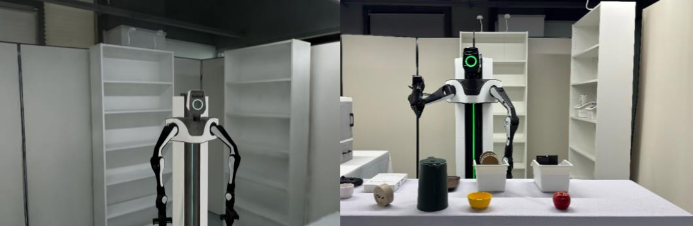
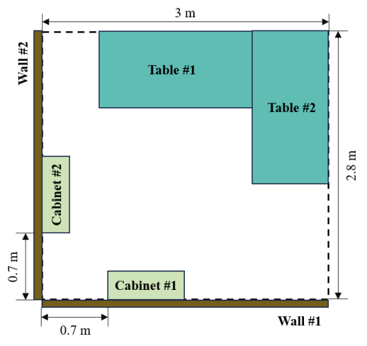
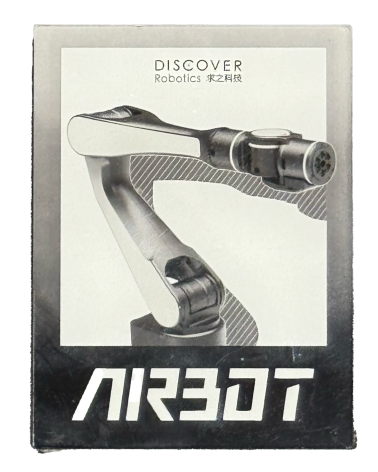
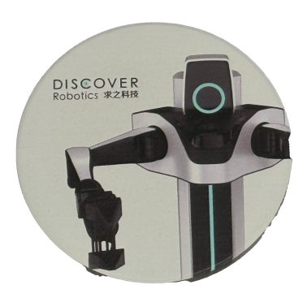
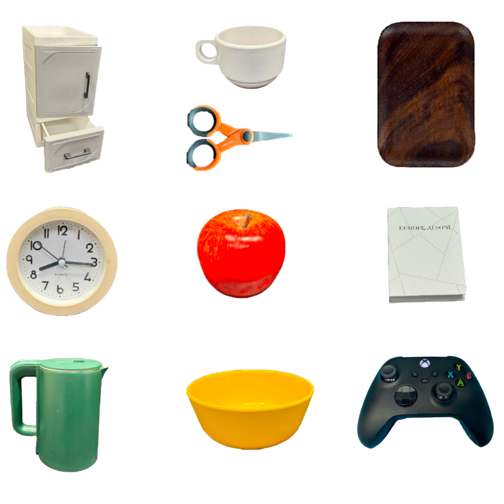

# Sim2Real2025rules

**声明**：中文内容来自有道翻译，仅供参考，并非比赛规则，请以英文版为准。

## 1. Introduction

The core of the Sim2Real Challenge 2025 ("S2R2025") is to allow participants to earn points by using the officially provided mobile dual-arm robot to perform rearrangement tasks. According to natural-language instructions, the robot picks up relevant objects and places them in designated locations to earn points. The goal of the challenge is to evaluate the operating performance in a practical application environment. Participants can train robot policies with limited real-world data and unlimited simulated data. Participants will be ranked based on the total points earned.

>   模拟现实挑战赛2025（“S2R2025”）的核心是让参与者使用官方提供的移动双臂机器人执行重排任务，从而获得积分。根据自然语言指令，机器人拿起相关物体并将其放置在指定位置以获得积分。挑战的目标是评估在实际应用环境中的操作性能。参与者可以用有限的真实数据和无限的模拟数据来训练机器人策略。参加者将根据所得的总分数排名。

    Figure 1. Simulation (left) and real-world (right) scenes with AIRBOT MMK2

## 2. Competition Area

In the competition area, there are three categories of items: the robot, objects with fixed positions (OPs) and objects with non-fixed positions (ONPs). All length units mentioned below are in meters.

>   在比赛区域内，有三类物品：机器人、固定位置物体（OPs）和非固定位置物体（ONPs）。下列长度单位均以米为单位。

### 2.1 Robot

The mobile dual-arm robot utilized for this challenge is AIRBOT MMK2: https://airbots.online/mmk2. The initial position of robot is roughly in the middle of competition area, facing table #1.

>   用于这项挑战的移动双臂机器人是AIRBOT MMK2: https://airbots.online/mmk2。机器人的初始位置大致在比赛区域的中间，面向1号桌。

### 2.2 Objects with Fixed Positions (OPs)

There are 2 walls, 2 tables and 2 cabinets with fixed positions illustrated in Figure 2.

Walls: covering 2 sides of the site with fences (height ≥ 0.3, for robot localization)

Tables: dimensions: 1.6 × 0.8 × 0.75, https://www.ikea.cn/cn/en/p/trotten-desk-white-s59429561/.

Cabinets: dimensions: 0.8 × 0.3 × 2.02, https://www.ikea.cn/cn/en/p/billy-bookcase-white-00522047/, the floors are indexed 1-6 from bottom to top, and detailed assembly information can be referred to Figure 3.

>   有2面墙，2张桌子和2个固定位置的柜子，如图2所示。
>
>
>   墙：场地2面设置围栏（高度≥0.3，用于机器人定位）
>
>
>   表：尺寸：1.6 × 0.8 × 0.75, https://www.ikea.cn/cn/en/p/trotten-desk-white-s59429561/。
>
>
>   机柜：尺寸：0.8 × 0.3 × 2.02, https://www.ikea.cn/cn/en/p/billy-bookcase-white-00522047/，地板从下到上编号为1-6，详细装配信息见图3。

    Figure 2. The top-view of objects with fixed positions

    Figure 3. The assembly details of cabinets

### 2.3 Objects with Non-fixed Positions (ONPs)

There are four categories of ONPs listed in Table 1.

>   表1列出了四类onp。

| Category | Structure | Texture | Initial Position                        | Movable | Interactable | Quantity |
| -------- | --------- | ------- | --------------------------------------- | ------- | ------------ | -------- |
| Box      | 1 Fixed   | Fixed   | Random in cabinets (floor 2-4)      | Yes     | Yes          | ≤6       |
| Prop     | 3 Fixed   | Random  | Random in/on boxes, tables, gadgets | Yes     | Yes          | ≤20      |
| Drawer   | 1 Fixed   | Fixed   | Random on tables                        | Yes     | Yes          | ≤1       |
| Gadget   | 9 Fixed   | Fixed   | Random on tables                        | Yes     | No           | ≤9       |

    Table 1. Overview of ONPs

**Boxes**: dimensions: 0.26 × 0.19 × 0.15, https://www.ikea.cn/cn/en/p/sockerbit-box-white-70316181/. Each box has an inner structure designed to support props, and each box contains only a single type of prop structure.

>   箱体：尺寸：0.26 × 0.19 × 0.15, https://www.ikea.cn/cn/en/p/sockerbit-box-white-70316181/。每个箱子都有一个用来支撑道具的内部结构，每个箱子只包含一种类型的道具结构。

    Figure 4. The illustration of boxes

**Props**: there are three types of props:

1. Sheet (dimensions: 0.08 × 0.06 × 0.0025),
2. Disk (dimensions: radius 0.11, thickness 0.005),
3. Carton (dimensions: 0.14 × 0.095 × 0.044).

The textures of props are random, and an example of ‘robot texture’ is shown in Figure 5.

>   道具：道具有三种类型：
>
>   1. 板材（尺寸：0.08 × 0.06 × 0.0025），
>
>   2. 圆盘（尺寸：半径0.11，厚度0.005）
>
>   3. 纸箱（尺寸：0.14 × 0.095 × 0.044）。
>
>
>   道具的纹理是随机的，“机器人纹理”的例子如图5所示。

    Figure 5. Props – sheet (left), disk (middle), carton (right)

**Drawer**: The drawer is a desktop cabinet with rotary and translation hinges, described as follows.

The cabinet has a flat bottom surface, while the outer side of the top surface is trapezoidal, and the inner side is flat. The height of the plane is equal to the lowest point of the trapezoidal surface. The length of the cabinet is 0.25 (the side with the door) and the width is 0.246. The height of the lowest point of the trapezoidal surface is 0.50 and the highest point is 0.52.

The rotary hinge has a cabinet door with a length of 0.25, a width of 0.29, and an internal depth of 0.346. The width of the inner platform is 0.03, and the distance between the bottom of the platform and the bottom of the cabinet is 0.254. 

The translation hinge has an outer width of 0.25 and a height of 0.16. The inner space of the hinge is rectangular with dimensions of 0.214 × 0.12 × 0.335.

>   抽屉：抽屉是一个桌面柜，有旋转和平移铰链，说明如下。
>
>   柜体底面为平面，顶面外侧为梯形，内侧为平面。平面的高度等于梯形面的最低点。机柜长度为0.25（带门一侧），宽度为0.246。梯形表面最低点的高度为0.50，最高点为0.52。
>
>   所述旋转铰链的柜门长度为0.25，宽度为0.29，内部深度为0.346。内平台宽度为0.03，平台底部到机柜底部的距离为0.254。
>
>   平移铰链的外宽为0.25，高度为0.16。铰链内部空间为矩形，尺寸为0.214 × 0.12 × 0.335。

    Figure 6. The drawer and gadgets

**Gadgets**: Nine non-repeating gadgets include an apple, a teacup, a clock, a kettle, an XBOX controllor, a bowl, a pari of scissors, a plate and a book. Gadgets cannot be manipulated on their own but possess physical properties. Specifically, props can be placed inside the teacup and the bowl, while props can be placed on top of the book.

>   **小工具**:9个不重复的小工具包括一个苹果、一个茶杯、一个时钟、一个水壶、一个XBOX控制器、一个碗、一把剪刀、一个盘子和一本书。小工具不能单独操作，但具有物理属性。具体来说，道具可以放在茶杯和碗的里面，道具可以放在书的上面。

## 3. Simulation Technology Architecture

### 3.1 Simulation Platform

The simulation platform for the competition is DISCOVERSE (https://air-discoverse.github.io/ ), a high visual fidelity intelligent robot simulation platform based on 3DG. It supports physics engine and high-fidelity scene rendering, and can be used for data collection and inference verification of end-to-end algorithm strategies.

>   竞赛的模拟平台是DISCOVERSE （https://air-discoverse.github）。io/)，基于3DG的高视觉保真智能机器人仿真平台。支持物理引擎和高保真场景渲染，可用于端到端算法策略的数据采集和推理验证。

### 3.2 Data Interface

ROS2 can be used to connect DISCOVERSE simulation and the players’ strategy algorithms. The organizing committee will provide a unified robot sensor data acquisition interface and actuator control interface based on ROS2. Players will focus on developing the robot algorithm strategy. For details on the sensor data provided, please refer to the competition tutorial documents.

>   ROS2可以用来连接DISCOVERSE仿真和玩家的策略算法。组委会将提供统一的基于ROS2的机器人传感器数据采集接口和执行器控制接口。玩家将专注于开发机器人算法策略。有关所提供传感器数据的详细信息，请参阅竞赛指南文件。

### 3.3 Platform Architecture

The simulation platform architecture is divided into two parts: server and client. 

The Server is a Docker image of the DISCOVERSE environment configured by the organizing committee. In the simulation environment, the server provides robot models, object props, and competition scenes to the participating teams. This module is responsible for accepting the robot execution instructions issued by the algorithm developed by the contestants, performing physical simulations and scene rendering, and providing robot sensor data to the contestants. The Server system also runs the game monitoring system and referee system.

The client simulates the hardware resource of the model's real robot. In the client, players develop algorithms and call a unified data interface to obtain sensor data and issue actuator instructions.

>   仿真平台体系结构分为服务器和客户端两部分。
>
>   服务器是组委会配置的discovery环境的Docker镜像。在仿真环境中，服务器为参赛队伍提供机器人模型、对象道具、比赛场景等。该模块负责接受选手开发的算法发出的机器人执行指令，进行物理模拟和场景渲染，并向选手提供机器人传感器数据。服务器系统还运行着比赛监控系统和裁判系统。
>
>   客户端模拟模型真实机器人的硬件资源。在客户端，玩家开发算法并调用统一的数据接口来获取传感器数据并发出执行器指令。

## 4. Competition Process

The competition mainly consists of four stages: simulator test, Sim2Real test, official competition, and on-site competition.

>   比赛主要包括四个阶段：模拟器测试、Sim2Real测试、正式比赛和现场比赛。

### 4.1 Simulator Test

Participants will gain access to a standardized simulation environment which includes a completely replica of the competition field and a standard mobile dual-arm robot with a lifting mechanism. Each team needs to write algorithms in this simulation environment so that the robot can autonomously make decisions, control and perform rearrangement tasks according to the human language command.

>   参赛者将进入一个标准化的模拟环境，其中包括一个完全复制的比赛场地和一个标准的带升降机构的移动双臂机器人。每个团队需要在这个仿真环境中编写算法，使机器人能够根据人类的语言命令自主决策、控制和执行重排任务。

### 4.2 Sim2Real Test

Each team has the opportunity to submit their scripts to the server via Docker once a week, and the server will automatically deploy the code to a real-world environment for testing. After each run, teams will receive a test log and third-person video. Teams need to refine their algorithms through a debugging process. Scores will be calculated based on submitted performance.

>   每个团队每周都有机会通过Docker向服务器提交一次脚本，服务器将自动将代码部署到真实环境中进行测试。每次运行后，团队将收到测试日志和第三人称视频。团队需要通过调试过程来完善他们的算法。分数将根据提交的成绩计算。

### 4.3 Official Competition

In the final competition stage, teams will submit a final version of their program to the judges and conduct 2 test runs on real-world robots. Teams will be ranked based on their highest score out of the 2 test runs, and the winning team will be rewarded with a certificate and corresponding bonus.

>   在最后的比赛阶段，参赛队伍将向评委提交最终版本的程序，并在现实世界的机器人上进行两次测试。各队将根据在两次测试中取得的最高分进行排名，获胜的队伍将获得证书和相应的奖金。

### 4.4 On-site Competition (optional)

In parallel with the sim2real challenge, participants can use their own hardware to participate in an on-site real-robot competition with the same theme at ICRA 2025. Further details will be released soon.

>   与sim2real挑战同时，参与者可以使用自己的硬件在ICRA 2025上参加相同主题的现场真实机器人比赛。进一步的细节将很快公布。

## 5. Competition Mechanism

### 5.1 Overview

The robot, OPs and ONPs are initialized (defined in Section 2) when each game starts. In each round of the game, within the limited 30 minutes, the robot should autonomously follow 3 round natural-language instructions to finish three rearrangement tasks. All instructions are valid and feasible. The 1st round instruction is sent to the robot at the beginning of the game. The 2nd round and 3rd round instructions will be sent once the robot finish the previous-round task. The game will be terminated immediately under one of the following conditions: (a) the robot finishes all three tasks; (b) the game time lasts for 30 minutes; or (c) the judge decides to terminate the game due to violations or safety issues. There is no retry opportunity during the game period.

>   每次游戏开始时，机器人、OPs和onp被初始化（在第2节中定义）。每轮比赛，机器人在限定的30分钟内，自主按照3轮自然语言指令完成3个重排任务。所有指令均有效可行。第一轮指令在比赛开始时发送给机器人。机器人完成上一轮任务后，将发送第二轮和第三轮指令。在下列情况之一的情况下，比赛将立即终止：(a)机器人完成所有三项任务；(b)比赛时间为30分钟；或(c)裁判因违规或安全问题决定终止比赛。在游戏期间没有重试的机会。

    Table 2. Instruction specifications and samples

| Round | Instuction                                                   | Instruction samples                                          |
| ----- | ------------------------------------------------------------ | ------------------------------------------------------------ |
| 1     | Take the prop-name from cabinet-location, and put it to table-location. | Take the disk from the second floor of the left cabinet, and put it to the left side of the left table. |
| 2     | Find the prop-name with texture-description, and put it direction-to the obj-name. | Find the carton with a surface featuring robot textures, and put it to the right of the apple. |
| 3     | Find another prop-name as same as the one direction-to the obj-name, and put it direction-to the obj-name. | Find another sheet as same as the one in the bowl, and put it in the drawer bottom-layer. |

| Round | Instuction                                                   | Instruction samples                                  |
| ----- | ------------------------------------------------------------ | ---------------------------------------------------- |
| 1     | 从cabinet-location获取道具名，并将其放到table-location。     | 从左侧机柜的第二层取出磁盘，放在左侧桌子的左侧。     |
| 2     | 找到带有纹理描述的道具名，并将其指向obj-name。               | 找到一个表面有机器人纹理的纸箱，把它放在苹果的右边。 |
| 3     | 找到与一个方向相同的另一个属性名称- obj-name，并将其指向- obj-name。 | 再找一张和碗里的一样的纸片，放在抽屉的底层。         |

### 5.2 Game instructions set

a. prop-name: {sheet, disk, carton}

b. cabinet-location: the {second/third/fourth} floor of the {left/right} cabinet

c. table-location: the {left/right} side of the {left/right} table

d. texture-description: natural-language describing the prop texture

e. direction-to: {on, to the left of, to the right of, in front of, behind, in}

f. obj-name: {drawer, drawer top-layer, drawer bottom-layer, apple, teacup, clock, kettle, XBOX
controllor, bowl, scissors, plate, book}

The ‘left’ cabinet/side/table is described in robot’s point of view. In contrast, the ‘left’ of obj-name is described in object’s point of view.

>   a.道具名称：{片、盘、盒}
>
>
>   b.柜子-位置：{左/右}柜子的{二/三/四}层
>
>
>   c. table-location:{左/右}桌的{左/右}侧
>
>
>   d. texture-description：描述道具纹理的自然语言
>
>
>   e. direction-to: {on， to左边，to右边，in front, behind, in}
>
>
>   f. obj-name:{抽屉，抽屉顶层，抽屉底层，苹果，茶杯，时钟，水壶，XBOX控制器、碗、剪刀、盘子、书}
>
>   “左”柜/边/桌是用机器人的视角来描述的。相比之下，obj-name的“左”则是从object的角度来描述的。

### 5.3 Scoring Rules

The participating teams will receive a maximum of 10 points via completing 10 checkpoint actions. In each round, 1 point is awarded after: (a) picking up the correct box, (b) clamping the correct prop, or (c) placing the correct prop to the designated position. In the third round, 1 point will be added after (d) finding the prop on the table. The detailed task criteria are as follows:

>   参赛队伍通过完成10个关卡动作最多可获得10分。在每一轮中，在以下情况下得1分：(a)拿起正确的箱子，(b)夹紧正确的道具，或(c)将正确的道具放置到指定位置。在第三轮中，(d)找到桌子上的道具后加1分。具体的任务标准如下：

a. A successful box pickup happens when both arms pick up the box and it leaves the cabinet.

b. A successful prop clamping happens when the clamped prop leaves the box.

c. A successful prop placing happens when the prop leaves the robot’s gripper and the distance between its actual position and the designated position is no more than 0.2m. The actual position refers to the center point of the prop’s bottom surface. The designated position for table-location refers to the center point of the specified half table area. The designated position for direction-to the obj-name refers to the point 0.2m away from the center of the object's bottom surface in the corresponding direction.

d. A successful prop finding happens when the robot captures a full-body photo for the prop.

Object occlusion or overhang will not be considered a successful placement, even if the distance criterion is met. 

>   a.当两个手臂拿起箱子，箱子离开机柜时，取箱成功。
>
>
>   b.当被夹住的道具离开箱体时，即成功夹住道具。
>
>
>   c.道具离开机器人的夹持器，实际位置与指定位置的距离不超过0.2m，即为道具放置成功。实际位置是指道具底面中心点。工作台位置的指定位置是指指定的半工作台区域的中心点。obj-name指定的方向位置是指在对应方向上距离物体底表面中心0.2m处的点。
>
>   d.当机器人捕捉到道具的全身照片时，就会成功找到道具。
>
>   即使满足距离标准，物体遮挡或悬垂也不会被认为是成功的放置。

The specific ranking rules are as follows:

R1: The highest score in the two rounds of the competition area will be used for ranking.

R2: If the highest scores are the same, the time of the last scoring point in the highest scoring round will be compared. If the time is still the same, the time of the penultimate scoring point will be compared, and so forth.

R3: If the time for each scoring point is the same, the round will replay. The rematch results are only used to distinguish the rankings of teams with the same score and do not participate in the overall ranking.

>   具体排名规则如下：
>
>   R1：以两轮赛区的最高分进行排名。
>
>   R2：如果最高得分相同，则比较最高得分轮中最后一个得分点的时间。如果时间仍然相同，将比较倒数第二个得分点的时间，以此类推。
>
>   R3：如果每个得分点的时间相同，则重赛。复赛结果仅用于区分得分相同队伍的排名，不参与总排名。

## 6. Season Schedule

<!-- skip -->

## 7. Participation

<!-- skip -->

## 8. Awards

<!-- skip -->

## 9. Appeals

<!-- skip -->

## 10. Q&A

<!-- skip -->
